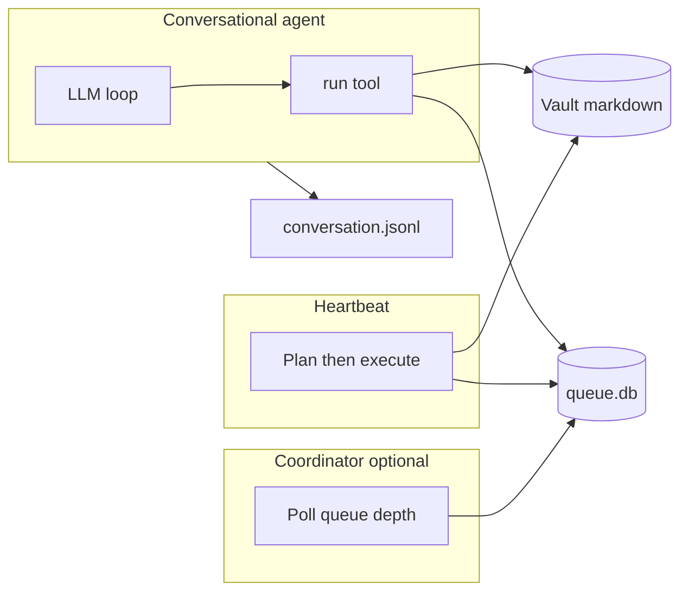

# Agent architecture

## Overview

Home Agent combines a **conversational** surface (voice or text), a **scheduled heartbeat**, an optional **coordinator** loop, and a shared **Obsidian vault** plus **SQLite queue**.

## Conversational agent

- **Entry points:** `main.py` (FastAPI + voice/STT/TTS), `server.py` (REST + WebSocket or `--cli`).
- **Engine:** `Runner` streams tokens and tool calls; the only tool exposed to the model is **`run(command="...")`**, which routes through `cli_handler.router` → `dispatch` (memory, skills, **note**, **queue**, unix whitelist, etc.).
- **Execution role:** `RoleScopedExecutor(ROLE_CONVERSATION)` sets a context var so mutating **`note`** subcommands (`new`, `write`, `mv`, `tag`) are **rejected**. Read-only **`note ls|read|find`** still work. Vault changes can be **queued** via `queue push --source conversation --action "..."`.
- **Persistence:** Conversation turns can append to **`{vault}/.heartbeat/conversation.jsonl`** (when configured). Session history for API/CLI is in-memory per process/session id.

## Heartbeat

- **Entry point:** `python -m src.heartbeat.run` (from repo root).
- **Phase 1 — digest:** Recent JSONL lines since `state.json`’s `last_run_at`, pending queue rows, vault index.
- **Phase 2 — plan:** LLM produces a markdown plan under `.heartbeat/plans/` and optional fenced JSON with `queue_inserts`.
- **Phase 3 — execute:** Second LLM run with **`RoleScopedExecutor(ROLE_HEARTBEAT)`** — full `note` / `queue` via `run()`.
- Flags: `--no-llm`, `--plan-only`, `--check-depth` (see [heartbeat-scheduling.md](heartbeat-scheduling.md)).

## Coordinator

- When **`HOMEAGENT_ENABLE_COORDINATOR`** is true, `main.py` lifespan starts a background task that periodically calls **`spawn_on_demand_if_needed()`** (queue depth vs `HOMEAGENT_HEARTBEAT_QUEUE_THRESHOLD`).
- Future work: idle gating, WebSocket delivery of `needs_user` items, shared history injection.

## Data flows

| Data | Location |
|------|-----------|
| Notes | Paths under `HOMEAGENT_VAULT`; `.heartbeat/` excluded from default listing/search |
| Queue | SQLite; default `{vault}/.heartbeat/queue.db` |
| Heartbeat artifacts | `.heartbeat/plans/`, `.heartbeat/logs/`, `state.json` |
| Conversation log | `.heartbeat/conversation.jsonl` |

## Events (streaming)

The loop emits: stream start/end, text deltas, tool use, tool results (stdout + exit), usage, errors. Handlers adapt this to CLI, WebSocket, or silent mode.

Configuration for all env vars: [configuration.md](configuration.md).
